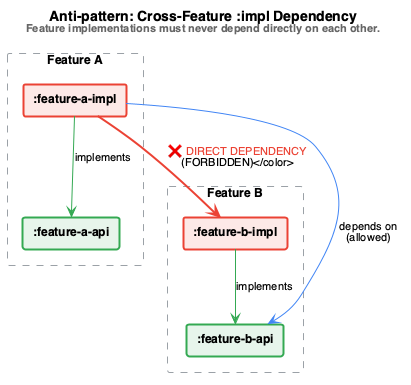

# Creating Decoupled Components

This skill describes how to create a decoupled software component in a project. A
component is split into a public **API surface** and a hidden **implementation**, so
that clients depend only on a stable contract and never on internal details.

## Core idea

A component exposes an API surface to its users. This surface is a contract: it should
not change except for a major version bump. Everything else — the implementation — is
free to change at any time, because clients never see it.

This split is enforced at the module level. There are (at least) two Gradle modules:

- `$component-api` — the public contract. Clients depend on this.
- `$component-impl` — the implementation. Clients do **not** depend on this directly.


> The diagram is generated from [`architecture.puml`](architecture.puml) with
> `plantuml -tpng architecture.puml`.

While the diagram above shows the *static* module dependencies, the sequence below
shows the *runtime* flow: the composition root wires the implementation in, the client
obtains an instance through the public entry point, and calls then dispatch to the
hidden implementation via the interface.


> The diagram is generated from [`sequence.puml`](sequence.puml) with
> `plantuml -tpng sequence.puml`.

## The API module (`$component-api`)

Contains only the contract: the interfaces clients call, plus any data types that are
part of the public surface. Nothing here exposes how the work is actually done.

```kotlin
// module: $component-api

data class SampleData(val userName: String, val age: Int)

interface ComponentApi {
    suspend fun loadData(): SampleData
    suspend fun saveData(data: SampleData)
}
```

Both `ComponentApi` and `SampleData` are part of the public API. Neither can change in a
breaking way without a major version bump (Semantic Versioning).

> If the component lives inside a closed internal project and is never published (e.g.
> not pushed to Maven Central), strict versioning matters less, since there are no
> external consumers to break. The *discipline* of keeping the surface stable still
> pays off, because it keeps internal callers decoupled.

## The implementation module (`$component-impl`)

Depends on `$component-api` and implements the contract. Because clients never depend on
this module, its classes can and should be `internal` (or `private` where it fits), so
nothing leaks accidentally.

```kotlin
// module: $component-impl

internal class ComponentApiImpl : ComponentApi {
    override suspend fun loadData(): SampleData { /* ... */ }
    override suspend fun saveData(data: SampleData) { /* ... */ }
}
```

The implementation class itself is `internal`: a client could not reference
`ComponentApiImpl` even if it wanted to, because it is not visible outside its module.

## Build Configuration: Gradle & Maven Setup

To enforce this boundary at compile time, configure your build tool to hide implementation details from the client modules.

### Gradle Setup (via the `java-library` plugin)

The `java-library` plugin introduces the distinction between `api` (transitive compile-time dependencies) and `implementation` (internal dependencies, hidden from consumers).

1. **The API module (`$component-api`)**:
   Uses the `java-library` plugin so it can declare transitive dependencies via the `api` configuration.
   ```kotlin
   // $component-api/build.gradle.kts
   plugins {
       `java-library`
       kotlin("jvm")
   }

   dependencies {
       // Transitively exposes dependencies that are part of the public API signatures
       api("org.jetbrains.kotlinx:kotlinx-coroutines-core:1.8.0")
       
       // Internal dependencies of the api module (not leaked to clients)
       implementation("org.slf4j:slf4j-api:2.0.0")
   }
   ```

2. **The Implementation module (`$component-impl`)**:
   Uses `implementation` to depend on the API. All its third-party libraries (databases, HTTP clients) are kept internal.
   ```kotlin
   // $component-impl/build.gradle.kts
   plugins {
       kotlin("jvm")
   }

   dependencies {
       // Implements the API contract
       implementation(project(":$component-api"))

       // Hidden implementation details (e.g. database, network engine)
       implementation("io.ktor:ktor-client-cio:2.3.0")
       implementation("io.insert-koin:koin-core:3.5.0")
   }
   ```

3. **The Client module**:
   Only depends on the stable API. The compiler will prevent imports from Ktor, Koin, or the concrete implementation.
   ```kotlin
   // $client-module/build.gradle.kts
   dependencies {
       implementation(project(":$component-api"))
   }
   ```

4. **The App module (Composition Root)**:
   Loads the implementation module. Whenever possible, declare this dependency as `runtimeOnly` to ensure developers cannot write code in the `:app` module that directly references internal classes of `:impl`.
   ```kotlin
   // :app/build.gradle.kts
   dependencies {
       implementation(project(":$component-api"))
       runtimeOnly(project(":$component-impl")) // Exposes implementation only at runtime
   }
   ```

### Maven Setup (via dependency scopes)

In Maven, use dependency `<scope>` to control classpaths:

* **Implementation Module**: Depends on `:api` with default `compile` scope.
* **Client Module**: Depends on `:api` with `compile` scope.
* **App Module (Composition Root)**: Declares a dependency on `:impl` with `<scope>runtime</scope>` to prevent compile-time references to implementation classes.

```xml
<!-- :app/pom.xml -->
<dependencies>
    <dependency>
        <groupId>com.example</groupId>
        <artifactId>component-api</artifactId>
        <version>1.0.0</version>
    </dependency>
    <dependency>
        <groupId>com.example</groupId>
        <artifactId>component-impl</artifactId>
        <version>1.0.0</version>
        <scope>runtime</scope> <!-- Enforces runtime-only lookup -->
    </dependency>
</dependencies>
```

## Connecting the client to the implementation

The interesting question: an interface cannot do anything on its own, so the client
needs an actual instance — but it must obtain one **without depending on the impl
module**. The component therefore has to provide a public **entry point** that hands out
an instance typed as the interface.

The public part typically exposes a **factory**, but a factory is not the only option —
use whatever construction shape fits the component. What matters is that the entry point
is public, lives in (or is reachable via) the API surface, and returns the interface
type, never the concrete class.

### The public entry point is part of the contract

Whatever construction shape you pick lives in the public surface and is therefore subject
to the same stability rule as the rest of the API: it should not change in a breaking way
between major versions. Further interfaces returned or required by the entry point follow
the **same pattern** — they are declared in the API module, implemented `internal`ly, and
obtained only through the public surface.

### Option A — Factory function in the API module

The API module declares the factory; the impl module provides the body. The client calls
the factory and receives a `ComponentApi`, never knowing the concrete type.

```kotlin
// module: $component-api
fun ComponentApi(/* required collaborators */): ComponentApi = createComponentApi(/* ... */)
```

This is the lightest-weight option, but requires a runtime registry pattern (e.g., a
factory lambda registered by the `:impl` module at startup), because the API module cannot
statically reference the implementation class due to Gradle dependency constraints.

### Option B — Factory object exposed by the impl module

The impl module exposes one public factory; everything else stays `internal`. The client
depends on `$component-api` for the *type* and calls the factory only at the composition
root.

```kotlin
// module: $component-impl
object ComponentFactory {
    fun create(/* required collaborators */): ComponentApi = ComponentApiImpl(/* ... */)
}
```

Here only `ComponentFactory` is visible from outside; `ComponentApiImpl` remains hidden.

### Option C — Builder in the API module (for configuration)

When the component needs configuration — values that are optional, or that the client
*must* supply before a valid instance can exist — expose a **builder** in the API module.
To avoid circular module dependencies, the builder should produce a stable, read-only
configuration data class (`ComponentConfig`) that is then passed to the factory or DI
setup, rather than instantiating the implementation class directly inside the API module.
This keeps required wiring explicit and self-documenting while still hiding the
implementation.

```kotlin
// module: $component-api
data class ComponentConfig(
    val timeoutMs: Long,
    val storage: Storage,
)

class ComponentBuilder {
    private var timeoutMs: Long = 5000L
    private var storage: Storage? = null

    // optional configuration
    fun withTimeout(ms: Long): ComponentBuilder = apply { this.timeoutMs = ms }

    // mandatory configuration: build() fails if it was never supplied
    fun withStorage(storage: Storage): ComponentBuilder = apply { this.storage = storage }

    fun build(): ComponentConfig {
        val storage = storage ?: error("Storage is required")
        return ComponentConfig(timeoutMs, storage)
    }
}
```

The client passes the resulting `ComponentConfig` to the public entry point (the factory
from Option B, or a DI definition), which hands it on to the `internal` implementation —
so the API module never references the concrete class.

Use a builder when there are enough configuration knobs — or hard requirements — that a
single factory call would be awkward or easy to misuse. For one or two simple
collaborators, a factory (Option A or B) is usually clearer.

### Option D — Dependency injection (optional refinement)

Dependency injection is **one possible way** to deliver the instance, not a requirement.
With a DI framework like Koin (using Koin Annotations), the implementation module
automatically binds the implementation to the interface via `@Single` or `@Factory`. The
client injects the dependency without knowing the concrete class.

```kotlin
// module: $component-impl
@Single(binds = [ComponentApi::class])
internal class ComponentApiImpl : ComponentApi { /* ... */ }
```

The binding only takes effect once the implementation module is loaded at the composition
root. With Koin Annotations you declare a module in `$component-impl` and load its
generated `.module` extension from `:app`:

```kotlin
// module: $component-impl
@Module
@ComponentScan
class ComponentImplModule
```

```kotlin
// module: :app (composition root) — the only place allowed to depend on $component-impl
startKoin {
    modules(ComponentImplModule().module)
}
```

This automates what the other options do by hand, at the cost of adopting the framework,
and reinforces the rule that only `:app` wires the `:impl` modules into the object graph.

## Unit Testing: Mocks vs. Fakes

Decoupling the API from the implementation lets client modules be tested in isolation. Instead of standing up real databases, networks, or a full dependency tree, the test uses a **test double** (either a dynamic mock or a hand-written fake) that implements the public interface. Because clients only depend on `$component-api`, they never need `$component-impl` to run their unit tests.

### Option A — Mocking with Mokkery (Kotlin Multiplatform)

If the project is a Kotlin Multiplatform (KMP) project, Mokkery is a great compiler-plugin-based mocking tool:

```kotlin
// module: $client-feature-test (KMP / Multiplatform)
import dev.mokkery.answering.returns
import dev.mokkery.everySuspend
import dev.mokkery.mock
import kotlinx.coroutines.test.runTest

@Test
fun viewModel_exposes_loaded_user_mokkery() = runTest {
    val mockApi = mock<ComponentApi> {
        everySuspend { loadData() } returns SampleData("John Doe", 30)
    }

    val viewModel = MyViewModel(mockApi)
    viewModel.loadUser()

    assertEquals("John Doe", viewModel.state.value.userName)
}
```

(`everySuspend` is used because `loadData()` is a `suspend` function.)

### Option B — Mocking with MockK (Kotlin JVM / Android)

For traditional JVM or Android projects, MockK is the standard library:

```kotlin
// module: $client-feature-test (JVM / Android)
import io.mockk.coEvery
import io.mockk.mockk
import kotlinx.coroutines.test.runTest

@Test
fun viewModel_exposes_loaded_user_mockk() = runTest {
    val mockApi = mockk<ComponentApi>()
    coEvery { mockApi.loadData() } returns SampleData("John Doe", 30)

    val viewModel = MyViewModel(mockApi)
    viewModel.loadUser()

    assertEquals("John Doe", viewModel.state.value.userName)
}
```

(`coEvery` is used for suspending functions; use `every` for regular functions.)

### Option C — Fake Implementations (Fakes)

Instead of using mocking libraries (which rely on reflection or compiler plugins, compile slower, and can make tests fragile to refactoring), you can write a manual **Fake** (test double) that implements the stable API interface.

Fakes can live in the client's test source set or be shared via an `:api-test` module:

```kotlin
// module: $client-feature-test or :component-api-test
class FakeComponentApi : ComponentApi {
    private var data: SampleData = SampleData("Default User", 25)
    var shouldFail: Boolean = false

    override suspend fun loadData(): SampleData {
        if (shouldFail) throw IllegalStateException("Simulated network failure")
        return data
    }

    override suspend fun saveData(data: SampleData) {
        this.data = data
    }

    // Helper method to set up test scenarios
    fun seedData(data: SampleData) {
        this.data = data
    }
}
```

The test is clean, readable, and executes extremely fast:

```kotlin
@Test
fun viewModel_exposes_loaded_user_fake() = runTest {
    val fakeApi = FakeComponentApi().apply {
        seedData(SampleData("John Doe", 30))
    }

    val viewModel = MyViewModel(fakeApi)
    viewModel.loadUser()

    assertEquals("John Doe", viewModel.state.value.userName)
}
```

Being able to swap implementations so easily in tests is one of the strongest reasons for the api/impl split.

## What the client sees

Regardless of which entry point is chosen, the client's view is identical and minimal:

```kotlin
// client module — depends ONLY on $component-api
val component: ComponentApi = /* factory call, builder.build(), or DI lookup */
val data = component.loadData()
```

The client knows the interface and the entry point. It knows nothing about
`ComponentApiImpl`, and a change to the implementation module never forces the client to
recompile against a new type.

## Common Anti-patterns

Watch out for these common design mistakes that break the Dependency Inversion Principle:

### Anti-pattern 1: Leaking Concrete/Internal Types in the API
The `:api` module must not reference any concrete classes from `:impl`. Furthermore, it should not expose internal-only concepts or external libraries that clients shouldn't know about.

```kotlin
// ❌ BAD: The API interface exposes the concrete internal implementation class
interface ComponentApi {
    fun getImplementationDetail(): ComponentApiImpl // Compile error! API doesn't know about Impl.
}

// ❌ BAD: The API exposes a library-specific type that leaks the implementation detail
// (e.g. database-specific exceptions or Room/SQLDelight query types)
interface ComponentApi {
    fun getQueryResults(): io.requery.query.Result<SampleData> // Leaks the query engine
}
```

*Solution:* Always return stable interfaces, standard library types, or pure domain data classes declared in the `:api` module.

### Anti-pattern 2: Cross-Feature `:impl` Dependencies
A feature module `:feature-a-impl` should never declare a dependency on `:feature-b-impl`.



> The diagram is generated from [`anti-pattern-cross-dependency.puml`](anti-pattern-cross-dependency.puml) with
> `plantuml -tpng anti-pattern-cross-dependency.puml`.

*Solution:* `:feature-a-impl` must only depend on `:feature-b-api`. The actual wiring between feature implementations must happen exclusively at the composition root (e.g. `:app` module).

### Anti-pattern 3: Circular Gradle Dependencies
This happens when you try to create an instance of the implementation directly inside the `:api` module. Because `:impl` depends on `:api`, `:api` cannot depend on `:impl` without creating a circular dependency.

```kotlin
// ❌ BAD: Creating a circular dependency by referencing the concrete implementation in API
// module: $component-api
object ComponentApiFactory {
    fun create(): ComponentApi = ComponentApiImpl() // Compile error: unresolved reference
}
```

*Solution:* Use a public entry point that delegates creation (e.g. a runtime registry / factory lambda pattern, a factory class in `:impl` referenced only by the composition root, or dependency injection).

## Summary of the rules

- The API surface is a contract; treat it as immutable between major versions.
- Put the contract (interfaces + public data types) in `$component-api`.
- Keep `$component-api` pure Kotlin: avoid dependencies on databases, network, or
  platform libraries.
- Put the implementation in `$component-impl`, marked `internal`/`private`.
- Clients depend on `$component-api` only.
- **No feature module may depend directly on another feature's `:impl` module.** Only the
  composition root (typically the `:app` module, which loads the DI modules) is allowed to
  depend on `$component-impl` modules, so that it alone wires the object graph.
- Expose a public **entry point** so clients can obtain an instance typed as the
  interface, without depending on the implementation. A factory is the common shape, but
  a factory object, a builder (for optional or mandatory configuration), or dependency
  injection all satisfy this — choose per component.
- Further interfaces follow the **same pattern**: declared in the API module, implemented
  `internal`ly, obtained through the public surface.

